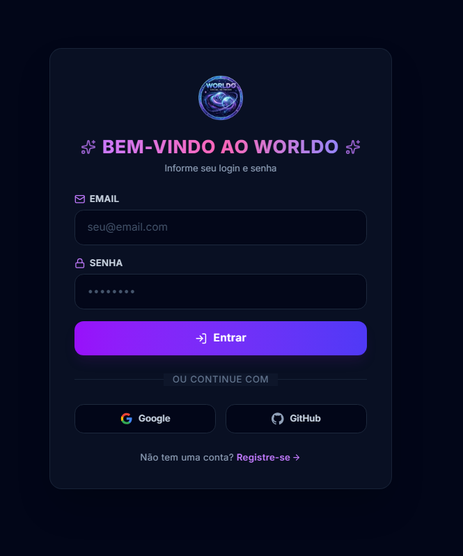
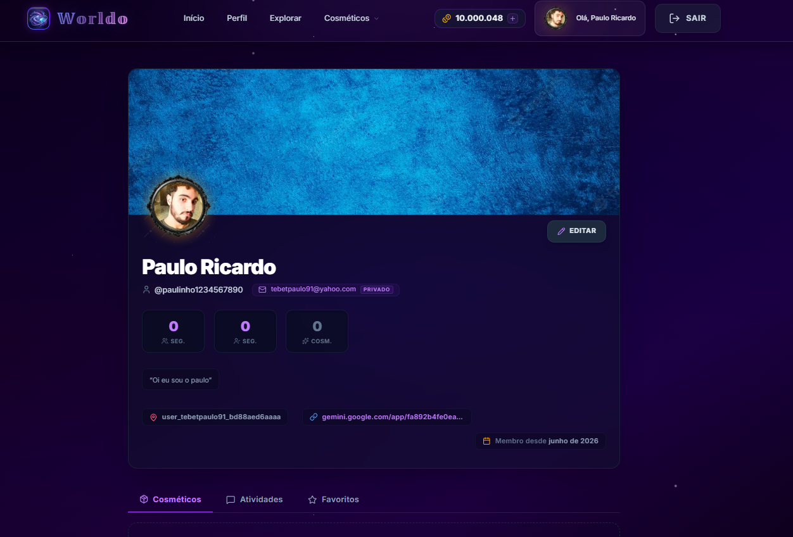
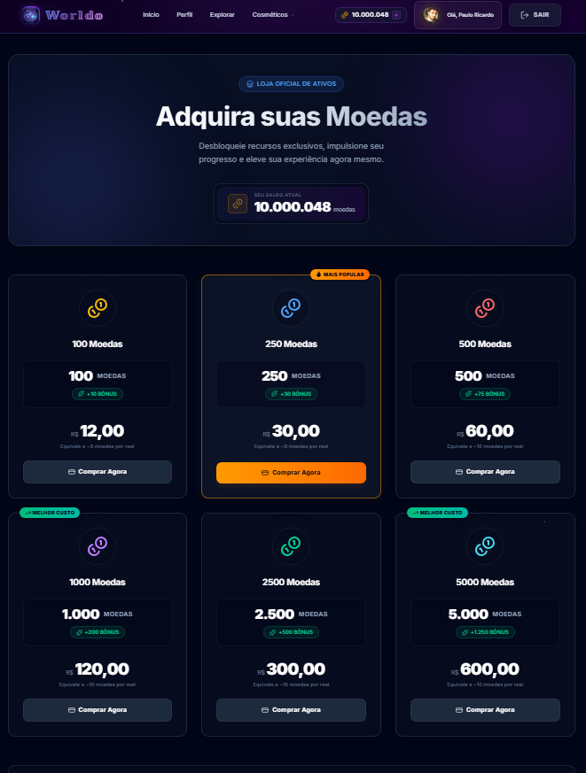
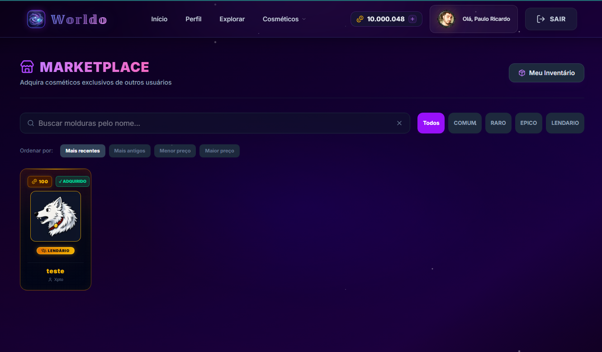
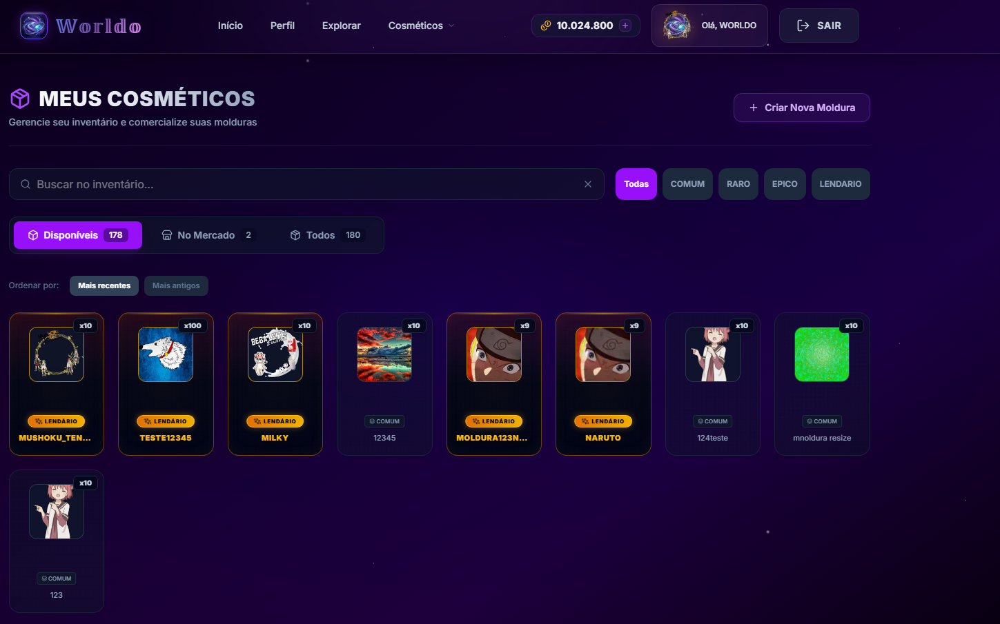

# backend

## Resumo

Projeto de uma rede social completa utilizando
NextJs, Prisma, React e PostgreSql

## Funcionalidades já implementadas

- Cadastro utilizando email pessoal, Github ou conta Google
- Upload de Avatar e Banner para perfil pessoal (Integração com módulo [backend](https://github.com/Paulouuul/worldo-backend-module) em outro repositório)
- Marketplace com busca otimizada com ElasticSearch
- Comércio de molduras para perfil criadas pelos próprios usuários
- Carrinho com items a serem comprados pelo usuário armazenado em cache no Redis (Integração com módulo [backend](https://github.com/Paulouuul/worldo-backend-module) em outro repositório)
- Compra de Moeda virtual própria da plataforma com cartão de crédito com Stripe
- Armazenamento de mídia dos usuários no Cloudflare R2 (Integração com módulo [backend](https://github.com/Paulouuul/worldo-backend-module) em outro repositório)
- Envio de email de confirmação com ReSend

## Integração com [Backend](https://github.com/Paulouuul/worldo-backend-module)

Este repositório interage com um módulo separado que contém um backend dedicado a algumas funções específicas da aplicação.
## Imagens

### Página de Login

### Perfil do usuário

### Compra de Moedas virtuais

### Marketplace de Molduras

### Inventário do usuário

